# 🎨 DIAGRAMA DE RELACIONES: PROSOCIAL PLATFORM

## 🏗️ ARQUITECTURA ACTUAL vs OPTIMIZADA

### 📊 **RELACIONES CLAVE - ESTADO ACTUAL**

```mermaid
graph TB
    %% ProSocial Platform Layer
    PP[ProSocial Platform]
    PA[ProSocial Agent]
    PL[ProSocial Lead]
    PAC[ProSocial Activity]
    RP[Revenue Product]

    %% Studio Layer
    S[Studio]
    SU[Studio User]
    P[Plan]
    C[Cliente]
    E[Evento]
    COT[Cotizacion]
    AG[Agenda]
    PAG[Pago]

    %% Legacy (a eliminar)
    AN[Anuncio System ❌]
    SP[SolicitudPaquete ❌]

    %% Revenue Sharing
    RT[Revenue Transaction]
    SRP[Studio Revenue Product]

    %% Relaciones ProSocial Platform
    PA --|manages| PL
    PL --|has many| PAC
    PL --|converts to| S
    RP --|enabled by| SRP
    S --|activates| SRP

    %% Relaciones Studio
    S --|subscribes to| P
    S --|has many| SU
    S --|has many| C
    S --|has many| E
    E --|has many| COT
    E --|has many| AG
    E --|has many| PAG

    %% Revenue Flow
    PAG --|generates| RT
    SRP --|generates| RT
    RT --|belongs to| S

    %% Legacy (desconectado)
    AN -.->|unused| S
    SP -.->|replaced by metadata| E

    classDef prosocial fill:#3b82f6,stroke:#1e40af,color:white
    classDef studio fill:#10b981,stroke:#047857,color:white
    classDef revenue fill:#f59e0b,stroke:#d97706,color:white
    classDef legacy fill:#ef4444,stroke:#dc2626,color:white

    class PA,PL,PAC,RP prosocial
    class S,SU,C,E,COT,AG,PAG studio
    class RT,SRP revenue
    class AN,SP legacy
```

### 🎯 **FLUJO DE DATOS OPTIMIZADO**

```mermaid
sequenceDiagram
    participant A as ProSocial Agent
    participant L as Lead
    participant S as Studio
    participant C as Cliente
    participant E as Evento
    participant P as Pago
    participant R as Revenue

    %% Flujo de conversión
    A->>L: Crea lead
    A->>L: Hace seguimiento
    L->>S: Se convierte en Studio

    %% Flujo operacional Studio
    S->>C: Gestiona clientes
    C->>E: Solicita evento
    S->>E: Crea cotización
    E->>P: Cliente paga

    %% Flujo revenue sharing
    P->>R: Genera transacción
    R->>S: 70% para Studio
    R->>A: 30% para ProSocial + comisión agente
```



## 🔥 **MODELOS POR ELIMINAR**

### ❌ **Anuncio System** (5 modelos)

```sql
-- ELIMINAR:
DROP TABLE anuncio_visitas;
DROP TABLE anuncios;
DROP TABLE anuncio_categorias;
DROP TABLE anuncio_tipos;
DROP TABLE anuncio_plataformas;
```

### ❌ **SolicitudPaquete** (1 modelo)

```sql
-- ELIMINAR:
DROP TABLE solicitud_paquetes;
```

**Justificación**:

- **Anuncios**: No aplicables en modelo B2B SaaS
- **SolicitudPaquete**: Reemplazado por metadatos en notificaciones

## ✅ **SCHEMA FINAL PROPUESTO**

### **CORE PROSOCIAL (5 modelos)**

1. `ProSocialLead` - Pipeline comercial
2. `ProSocialAgent` - Gestión agentes
3. `ProSocialActivity` - Seguimiento
4. `RevenueProduct` - Productos B2B2C
5. `StudioRevenueProduct` - Activaciones

### **CORE STUDIO (15 modelos principales)**

1. `Studio` - Tenant principal
2. `Plan` - Suscripciones
3. `StudioUser` - Usuarios del studio
4. `Cliente` - Clientes finales
5. `Evento` - Proyectos/eventos
6. `Cotizacion` - Presupuestos
7. `Pago` - Transacciones
8. `Agenda` - Calendario
9. `Servicio` - Catálogo servicios
10. `Paquete` - Bundles servicios
11. `RevenueTransaction` - Revenue sharing
12. `Configuracion` - Settings studio
13. `MetodoPago` - Formas de pago
14. `Nomina` - Gestión empleados
15. `Gasto` - Control gastos

### **SUPPORTING (5 modelos)**

1. `Sesion` - Autenticación
2. `EventoTipo` - Categorías eventos
3. `Canal` - Fuentes leads
4. `Negocio` - Info empresa
5. `CondicionesComerciales` - Términos

## 📊 **MÉTRICAS DE OPTIMIZACIÓN**

- **Modelos eliminados**: 6 (Anuncio system + SolicitudPaquete)
- **Modelos optimizados**: 25 → 19 core + 5 support = 24 total
- **Reducción**: ~20% menos complejidad
- **Enfoque**: 100% alineado al negocio ProSocial Platform

¿Procedemos con la limpieza? 🧹
